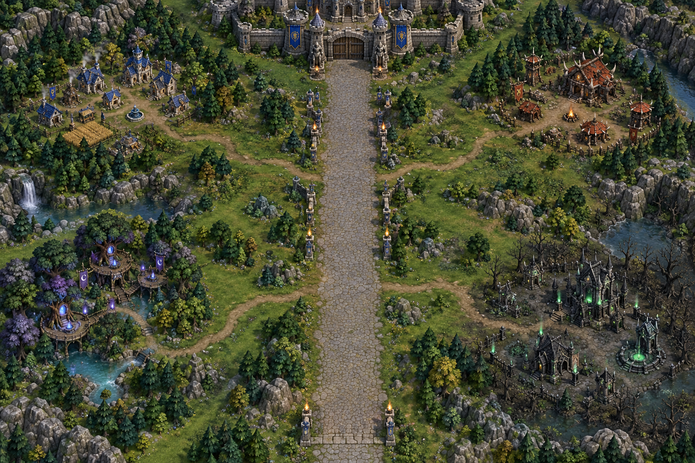
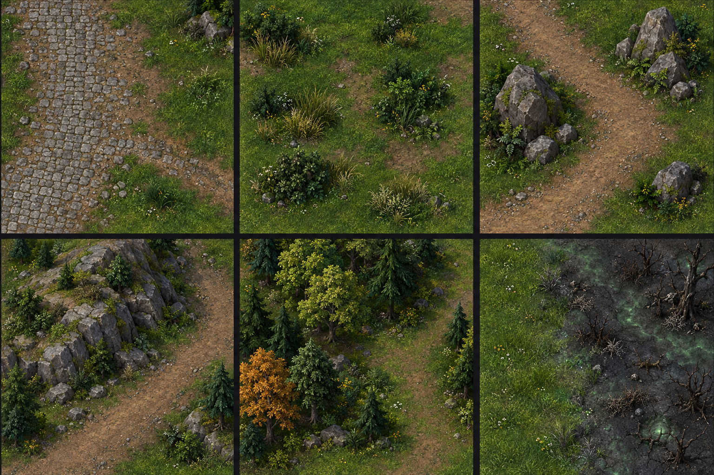

# Crownlands terrain-dressing guide

Use this generated reference as inspiration while hand-editing the map in World Editor. It illustrates the existing broad defense road, paths toward settlements, a rocky pass, a human outpost edge, and the transition into undead ground. It is concept art, not an exact map screenshot, terrain tile list, or pathing plan.

## What each panel suggests

1. **Road shoulder:** keep the King's Road wide and readable; soften its edges with irregular grass, small stones, shrubs, and a narrow branch path.
2. **Rocky pass:** group boulders in uneven clusters and let low rises frame the route. Leave a continuous open corridor for enemy movement.
3. **Settlement edge:** blend tidy paving near buildings into worn dirt and natural grass farther out. Small fences and tree groups can frame a town without forming a wall.
4. **Undead frontier:** shift gradually from healthy grass through sparse scrub and broken stone into corrupted ground. Keep the approach lane clear through the biome change.

## World Editor pass

- Preserve the existing north-to-south King's Road, open central gate, boss route, castle approach, and southern market access.
- Add dirt paths from the road to each settlement. Let the path width vary slightly and use a few grass or stone transition tiles so it does not look stamped as one rigid strip.
- Paint broad, soft-edged patches of lighter and darker grass instead of a checkerboard. Use small terrain details around the edges and leave build plots, mines, and worker routes open.
- Place boulders in groups with mixed sizes. Use low hills along the outside of bends and town borders; keep them clear of the road, gate, player plots, and tower firing lanes.
- Cluster trees and shrubs in uneven groves. Leave openings where workers need lumber access and where the path enters each town.
- Check doodad pathing after placement. Send a worker and a ground unit along every branch road, the full enemy route, and the routes between each base and its mine before saving.

The reference is meant to guide manual terrain dressing; it does not prescribe changes to the 192 × 192 map bounds or the approved defense layout.

## New map-dressing references — 2026-09-29

The overview below suggests how to make the Crownlands feel inhabited and varied. Treat the arrangement as mood and terrain inspiration; keep the actual map's King's Road, gate, keep, settlement entrances, base plots, mines, and boss route in their current positions.

Use this element sheet for details that can be reproduced with World Editor terrain tiles and doodads. Scatter each group with gaps and rotation variation; preserve open movement and build space.

## Full-map composition studies — 2026-09-29

These two additional generated images compare a more formal kingdom-road arrangement with a less symmetrical landscape. They are visual references, not exact map screenshots or tile-by-tile build instructions.

- [Formal King's Road layout](visuals/Crownlands-Layout-Formal-Road.png): balanced settlement clearings, branch roads, rocky road shoulders, and an open central avenue.
- [Asymmetric road and terrain layout](visuals/Crownlands-Layout-Asymmetric-Road.png): a gentle road bend, contrasting woodland and meadow sides, and low rocky rises set back from the route.

In both, keep the actual gate, King's Road, settlement entrances, boss-fight space, build plots, mines, and worker routes clear when translating the idea into the World Editor.

## Active World Editor pass — 2026-09-30

The current editor working copy is `build/KLS-D-8048eea39b-Development-Terrain.w3m`. Crownshire's southern outskirts now have an editor-placed barn, inn and well, with connecting dirt footpaths and low grassy rises outside the buildings. These edits are still unsaved and uncaptured while the editor's missing-player-start save prompt awaits approval. They are not present in the installed Development package.

Startup no longer stamps stone plot borders or repaints the central road in `source/game.j`. The W3E layer owns those textures; the procedural fallback already supplies roads and plot markers. Runtime resource trees and northern gate structures remain. This prevents subsequent editor art from being overwritten when a match starts.

Remaining work: soften the repeated square grass patches, finish the castle-town composition, dress all four settlements, add low hills and mixed boulder groups, review scripted building positions against the authored clearings, then save/capture the art and package one new Development build. Navigation, mines, gate and boss clearance require exact-build engine checks. Do not describe this pass as finished from the source regression alone.

### Editor continuation checkpoint

Camera zoom recovered after focusing the terrain canvas and issuing repeated wheel inputs. Broad grass strokes softened several square patches west and east of Crownshire and beside the castle approach. Four `VSvb` residence doodads were placed south of the courtyard at approximately (-1584, -2547), (1748, -2415), (-1174, -2389), and (1305, -2335). A narrow dirt connector was started at approximately (-1106, -2090); the residence paths are not yet complete. These remain unsaved editor changes, not captured art or an installed build.

Computer Use then failed with `failed to write kernel assets: The system cannot find the path specified. (os error 3)`. A lightweight window-list retry and a kernel reset/reinitialization returned the same error. Stop UI input until the connection is restored, preserve the open editor working copy, and resume with the incomplete courtyard-to-residence and residence-to-market paths. The missing-player-start save approval remains pending.

### Saved capture and visible layout — 2026-09-30

The user saved and closed the working map; the earlier unsaved checkpoint/save prompt is resolved. The grass, branch paths, cliffs, tree ring and saved doodads are preserved in the authored six-layer bundle, with the saved original archived. The next work copy now includes visible shops, four village clusters, quest sites, hero hub, castle/spring and provisional bases. See [EDITOR-LAYOUT.md](EDITOR-LAYOUT.md). These references guide terrain work; moving them does not update gameplay coordinates. Place purely decorative scenery with the Doodad Palette, because art capture excludes native units. Continue natural grass/path dressing in the current build's Terrain work copy. Visual/editor and post-save pathing checks remain pending because Computer Use is unavailable.
