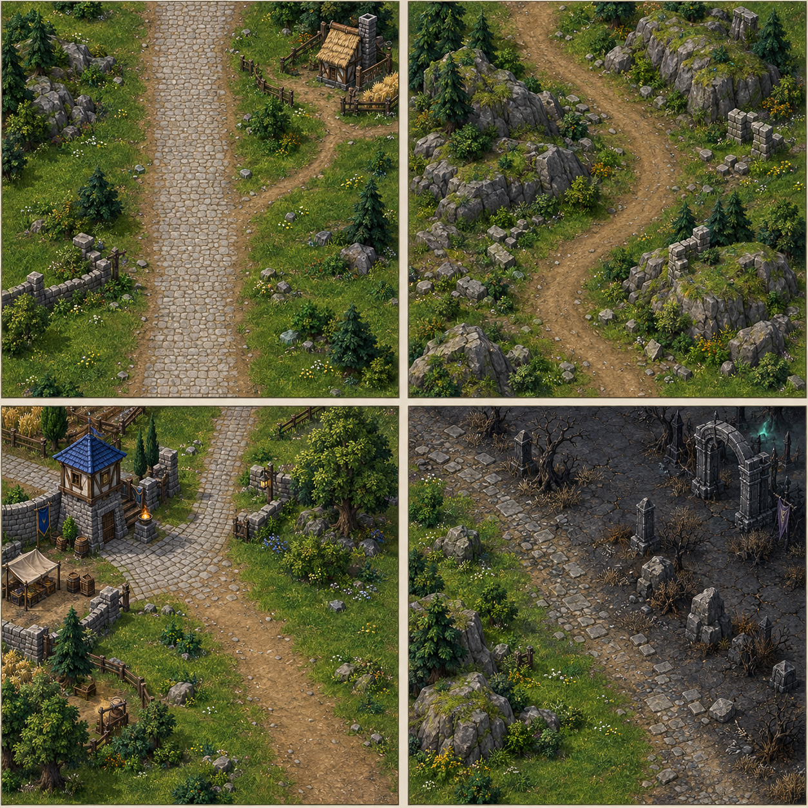

# Crownlands terrain-dressing guide

Use this generated reference as inspiration while hand-editing the map in World Editor. It illustrates the existing broad defense road, paths toward settlements, a rocky pass, a human outpost edge, and the transition into undead ground. It is concept art, not an exact map screenshot, terrain tile list, or pathing plan.

## What each panel suggests

1. **Road shoulder:** keep the King's Road wide and readable; soften its edges with irregular grass, small stones, shrubs, and a narrow branch path.
2. **Rocky pass:** group boulders in uneven clusters and let low rises frame the route. Leave a continuous open corridor for enemy movement.
3. **Settlement edge:** blend tidy paving near buildings into worn dirt and natural grass farther out. Small fences and tree groups can frame a town without forming a wall.
4. **Undead frontier:** shift gradually from healthy grass through sparse scrub and broken stone into corrupted ground. Keep the approach lane clear through the biome change.

## World Editor pass

- Preserve the existing north-to-south King's Road, open central gate, boss route, castle approach, and southern market access.
- Add dirt paths from the road to each settlement. Let the path width vary slightly and use a few grass or stone transition tiles so it does not look stamped as one rigid strip.
- Paint broad, soft-edged patches of lighter and darker grass instead of a checkerboard. Use small terrain details around the edges and leave build plots, mines, and worker routes open.
- Place boulders in groups with mixed sizes. Use low hills along the outside of bends and town borders; keep them clear of the road, gate, player plots, and tower firing lanes.
- Cluster trees and shrubs in uneven groves. Leave openings where workers need lumber access and where the path enters each town.
- Check doodad pathing after placement. Send a worker and a ground unit along every branch road, the full enemy route, and the routes between each base and its mine before saving.

The reference is meant to guide manual terrain dressing; it does not prescribe changes to the 192 × 192 map bounds or the approved defense layout.
